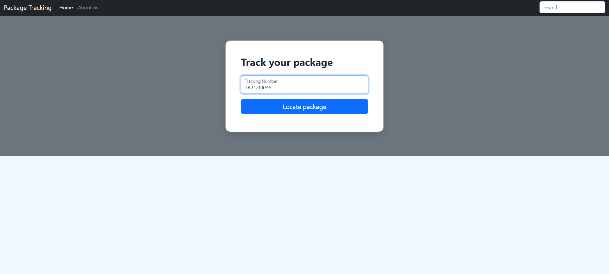
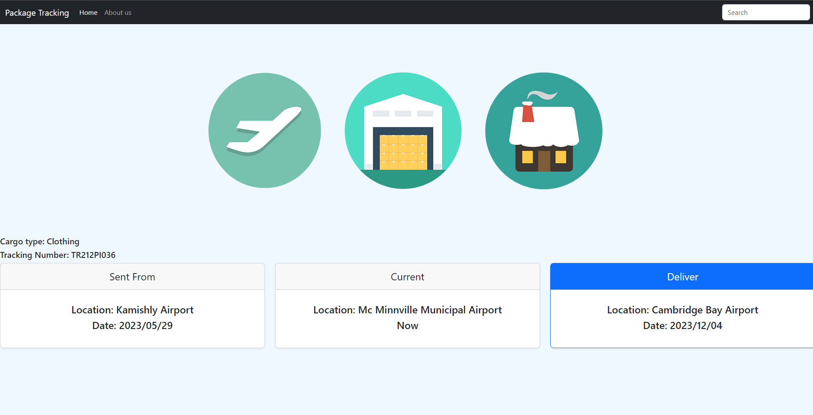
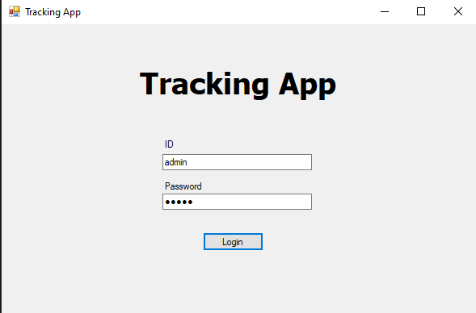
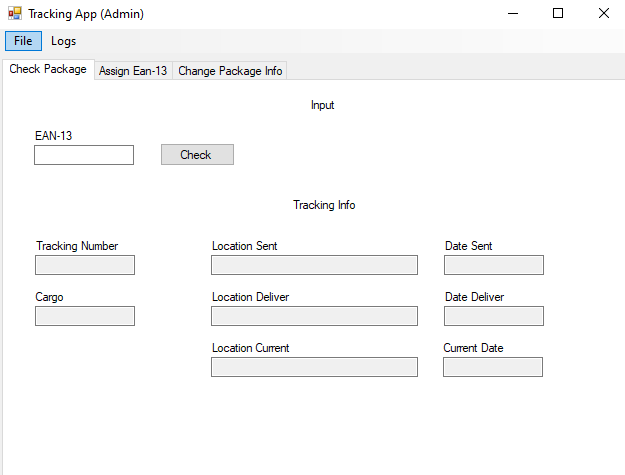
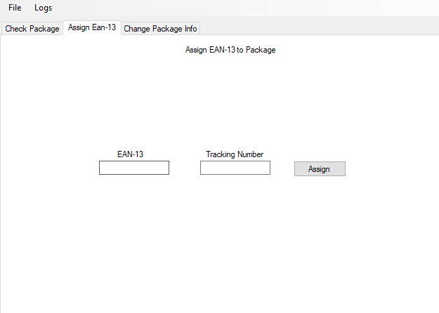
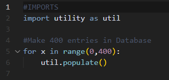
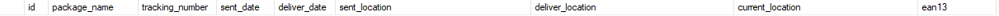
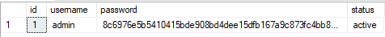
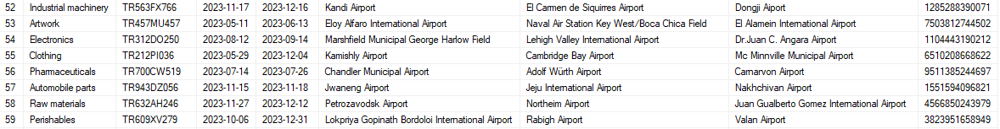

<h2><strong>Tracking App</strong></h2>

 
 
Tracking App is my personal passion project. It is used for tracking packages, updating packages info, updating location and more.

This contains: 
Site for clients - using tacking number to see current location of your package. 
Desktop Admin App - editing package data. 
Python Populate Script - Script that I've made to populate database with dummy data. 

 
Since it would be very hard for someone to understand this project without my DB sturucture. I whill explain it shortly.

 

<h3><strong>Site for clients</strong></h3>
 
On our site for clients we are prompted with simply inupt field that takes Tracking Number.

 
 
When Tracking number entered we get following information : Cargo type, Tracking Number, Location where it's sent from, Location where it's currently, Location where it's going to be delivered at, date when it's sent, date when it's recieved.

 
 

<h3><strong>Desktop Admin App</strong></h3>
 
In our Admin App we assign EAN-13 barcodes to our packages, we use those EAN-13 codes to indetify and update data of that package in our DB. Which is going to be relfected on website.

We are first presented with simple login.
 

 
 

When logged in we have three functions. 
Check Package - which basically does same as site just checks EAN13 instead of Tacking Number. 
Assign EAN 13 - We scan barcode and assign it to the package. 
Change Package Info - We change current location of package or any other info. 
 

 

 
 

<h3><strong>Python Populate Script</strong></h3>
 
In python <strong>main.py</strong> script we basically change for loop range to wanted quantity of database entries.
 
By calling function from  <strong>util.py</strong> called  <strong>populate()</strong> we generate fresh row of data and write it to our DB.
 
DB credentials could be entered in  <strong>database.py</strong>
 

 
 
<h3><strong>DB structure</strong></h3>
 
Columns in maindb -> tracking (table)
 

 
Columns in maindb-> auth (table)
 

 
Example of dummy data in tracking table
 

 
